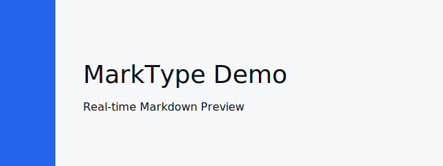

# MarkType Showcase

Welcome to the MarkType live demo file.
This document contains a collection of Markdown features to demonstrate the
editor, preview, linting, and theming.

## Headings

# H1 — Page Title

## H2 — Section

### H3 — Subsection

## Text styles

This is **bold** text, this is _italic_, and this is **_bold italic_**.

## Links and images

Link: [MarkType GitHub](https://github.com/KadeStanford/MarkType)

Local image (reliable):



## Lists

- Unordered list item 1
- Unordered list item 2
  - Nested item A
  - Nested item B

1. Ordered item one
2. Ordered item two

## Code blocks

Inline code: `const x = 42;`

Fenced code block (javascript):

```javascript
function greet(name) {
  return `Hello, ${name}!`;
}
console.log(greet("MarkType"));
```

Fenced code block (bash):

```bash
npm install
npm run dev
```

## Tables

| Component        | Purpose                                      |
| ---------------- | -------------------------------------------- |
| EditorMonaco.tsx | Monaco editor wrapper                        |
| Preview.tsx      | Markdown -> HTML render (marked + DOMPurify) |

## Blockquote

> This is an example blockquote — useful for callouts and notes.

## Task list

- [x] Create demo file
- [ ] Add screenshots
- [x] Test lint panel

## Math (KaTeX not installed)

Inline math: $E = mc^2$ (rendered as plain text in this demo)

## Horizontal rule

---

## Long sample content for scrolling

Lorem ipsum dolor sit amet, consectetur adipiscing elit. Integer nec odio.
Praesent libero. Sed cursus ante dapibus diam. Sed nisi. Nulla quis sem at
nihil elementum imperdiet.

Curabitur sodales ligula in libero. Sed dignissim lacinia nunc. Curabitur
tortor. Pellentesque nibh. Aenean quam. In scelerisque sem at dolor.

Maecenas mattis. Sed convallis tristique sem. Proin ut ligula vel nunc
egestas porttitor. Morbi lectus risus, iaculis vel, suscipit quis, luctus
non, massa.

Fusce ac turpis quis ligula lacinia aliquet. Mauris ipsum. Nulla metus
metus, ullamcorper vel, tincidunt sed, euismod in, nibh.

End of demo.
